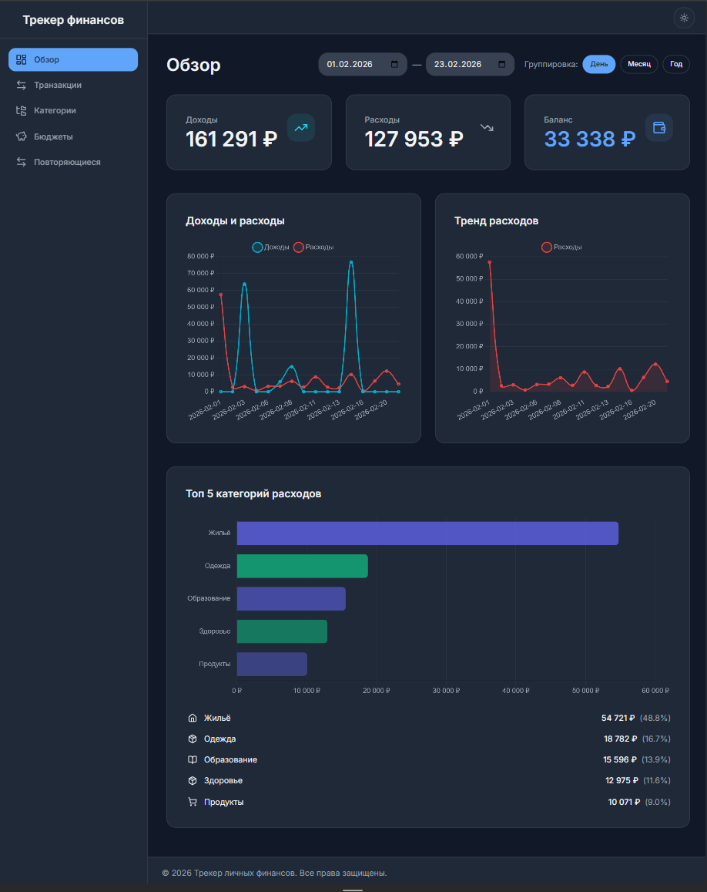

# Finance Tracker

Full-Stack приложение для управления личными финансами с поддержкой транзакций, категорий, бюджетов и визуализации данных.

## Описание проекта

Finance Tracker - это современное веб-приложение для трекинга личных финансов, которое позволяет:
- Управлять транзакциями (доходы и расходы)
- Организовывать категории с иконками и цветами
- Устанавливать и отслеживать бюджеты
- Визуализировать финансовые данные через дашборд с графиками
- Импортировать и экспортировать данные в CSV
- Работать с повторяющимися транзакциями
- Поддерживать мультивалютность

## Технологический стек

### Frontend
- Next.js 14+ (React)
- TypeScript
- Tailwind CSS
- Chart.js
- React Hook Form

### Backend
- FastAPI
- SQLAlchemy 2.0+ (async)
- PostgreSQL 15+
- Pydantic v2
- Alembic (миграции)

### DevOps
- Docker & Docker Compose
- GitHub Actions (CI/CD)
- Redis (для фоновых задач)
- Celery (фоновая обработка)

## Prerequisites

Для запуска проекта необходимо установить:

- **Node.js**: 18+ ([скачать](https://nodejs.org/))
- **Python**: 3.11+ ([скачать](https://www.python.org/))
- **Docker**: 24+ ([скачать](https://www.docker.com/))
- **Docker Compose**: 2.0+ (обычно идет с Docker Desktop)

## Установка и запуск

> **💡 Быстрый старт**: Для автоматической инициализации проекта смотрите [QUICKSTART.md](docs/QUICKSTART.md)

### Быстрый старт с Docker Compose

1. Клонируйте репозиторий:
```bash
git clone https://github.com/catarena-s/finance-tracker.git
cd finance-tracker
```

2. Запустите все сервисы:
```bash
docker-compose up -d
```

3. Миграции и seed данные применяются автоматически при первом запуске backend контейнера.

4. Приложение будет доступно по адресам:
   - Frontend: http://localhost:3000
   - Backend API: http://localhost:8000
   - API Documentation: http://localhost:8000/docs

Для проверки загрузки данных:
```bash
docker exec finance-tracker-db psql -U postgres -d finance_tracker -c "SELECT COUNT(*) FROM transactions;"
```

### Локальная разработка

#### Backend

```bash
cd backend
python -m venv venv
source venv/bin/activate  # Windows: venv\Scripts\activate
pip install -r requirements.txt
alembic upgrade head
uvicorn app.main:app --reload
```

#### Frontend

```bash
cd frontend
npm install
npm run dev
```

## Запуск тестов

### Backend тесты
```bash
cd backend
pytest
```

### Frontend тесты
```bash
cd frontend
npm test
```

## Структура проекта

```
finance-tracker/
├── backend/           # FastAPI приложение
├── database/          # Миграции и seed данные
├── docs/              # 📚 Документация проекта
│   ├── reports/       # Отчеты о разработке и тестировании
│   │   ├── IMPLEMENTATION_ANALYSIS.md
│   │   ├── INTEGRATION_TEST_REPORT.md
│   │   ├── REFACTORING_REPORT.md
│   │   ├── REFACTORING_SUMMARY.md
│   │   ├── REQUIREMENTS_COMPLIANCE.md
│   │   ├── VERIFICATION_REPORT.md
│   │   └── WARNINGS_ANALYSIS.md
│   ├── ADMIN_GUIDE.md
│   ├── ARCHITECTURE.md
│   ├── DATABASE_SCHEMA.md
│   ├── FRONTEND_TESTING_GUIDE.md
│   └── QUICKSTART.md
├── frontend/          # Next.js приложение
├── scripts/           # 🛠️ Утилиты и скрипты
│   ├── manual-tests/  # Ручные тесты для проверки (8 файлов)
│   ├── init.bat       # Инициализация (Windows)
│   └── init.sh        # Инициализация (Linux/Mac)
├── .github/           # GitHub Actions workflows
├── docker-compose.yml # Docker Compose конфигурация
├── CHANGELOG.md       # История изменений
├── CONTRIBUTING.md    # Руководство для контрибьюторов
├── REPORT.md          # Отчет о разработке проекта
└── README.md          # Этот файл
```

## Адаптивный дизайн

Приложение использует mobile-first подход с адаптивным дизайном для корректного отображения на всех устройствах от 320px до 1440px и выше.

Подробное руководство по адаптивному дизайну, включая систему брейкпоинтов, примеры использования, правила для новых компонентов и рекомендации по тестированию, смотрите в [документации по адаптивному дизайну](docs/RESPONSIVE_DESIGN.md).

## Документация

- [Быстрый старт](docs/QUICKSTART.md)
- [Архитектура проекта](docs/ARCHITECTURE.md)
- [Схема базы данных](docs/DATABASE_SCHEMA.md) - подробное описание таблиц и связей
- [Руководство администратора](docs/ADMIN_GUIDE.md) - настройки, фоновые задачи, мониторинг
- [Руководство по адаптивному дизайну](docs/RESPONSIVE_DESIGN.md) - брейкпоинты, правила, примеры
- [Руководство по тестированию Frontend](docs/FRONTEND_TESTING_GUIDE.md)
- [История изменений](CHANGELOG.md)
- [Руководство для контрибьюторов](CONTRIBUTING.md)
- [Отчет о разработке](REPORT.md) - история создания проекта
- [API документация](http://localhost:8000/docs) (после запуска)

### Отчеты о разработке и тестировании

- [Анализ реализации требований](docs/reports/REQUIREMENTS_COMPLIANCE.md)
- [Отчет по интеграционным тестам](docs/reports/INTEGRATION_TEST_REPORT.md)
- [Отчет о рефакторинге](docs/reports/REFACTORING_REPORT.md)
- [Краткая сводка рефакторинга](docs/reports/REFACTORING_SUMMARY.md)
- [Отчет о проверке](docs/reports/VERIFICATION_REPORT.md)
- [Анализ warnings](docs/reports/WARNINGS_ANALYSIS.md)
- [Анализ реализации](docs/reports/IMPLEMENTATION_ANALYSIS.md)

## Seed данные

Проект поставляется с демо-данными, которые загружаются автоматически при применении миграций:
- 200+ транзакций за последние 6 месяцев (15% доходы, 85% расходы)
- 14 категорий с иконками и цветами (9 расходов, 5 доходов)
- 3 бюджета
- 3 шаблона повторяющихся транзакций

Данные загружаются автоматически при выполнении:
```bash
docker exec finance-tracker-backend alembic upgrade head
```

Для ручной генерации новых seed данных транзакций:
```bash
cd database/seeds
python generate_transactions.py
```

## 📸 Скриншоты

<table>
  <tr>
    <td width="50%">
      <h3 align="center">Светлая тема</h3>
      
    </td>
    <td width="50%">
      <h3 align="center">Темная тема</h3>
      
    </td>
  </tr>
</table>

